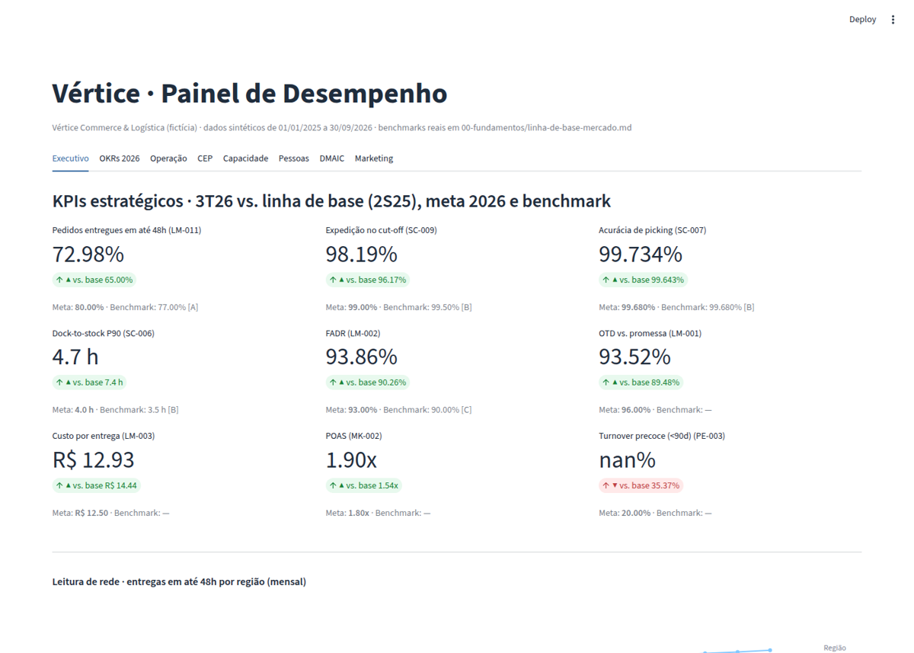
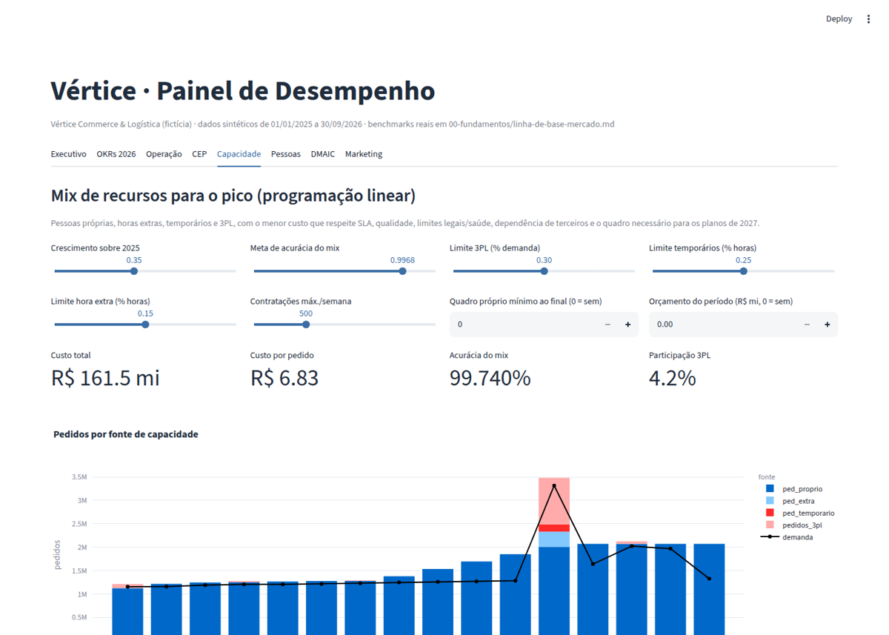
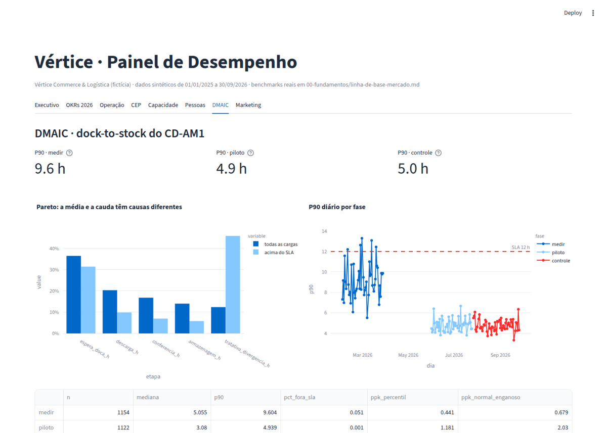

# KPIs · OKRs · SLAs

**Sistema de gestão de desempenho que conecta estratégia → execução → dados**, cobrindo operações logísticas ponta a ponta (supply chain, middle mile, last mile) e as funções que as sustentam (pessoas, marketing de tráfego, projetos, ágil e Lean Six Sigma).

> Princípio central: **OKR muda o sistema, KPI monitora a saúde do sistema, SLA contrata o nível de serviço entre partes.** Misturar os três é a causa mais comum de painéis com 80 indicadores e nenhuma decisão.

O repositório tem duas camadas:
1. **Biblioteca de referência**: fundamentos, templates e 8 áreas com árvores de KPIs, OKRs e SLAs.
2. **Caso integrado com ferramentas**: uma empresa fictícia de grande porte (*Vértice*), com dados simulados, pacote Python, app Streamlit, 3 notebooks didáticos (incluindo um projeto DMAIC completo) e modelo Power BI. Linha de base calibrada pelo que Mercado Livre, Amazon e WERC divulgam publicamente.



## Destaques do caso

| Pergunta executiva | Onde é respondida | Achado |
|---|---|---|
| Estamos longe da régua do mercado? | [Linha de base](00-fundamentos/linha-de-base-mercado.md) · app *Executivo* | Entregas em 48h: 65% → 73% no 3T26, contra 77% divulgados pelo Mercado Livre (2T26) |
| Como o pico se propaga? | Notebook §2 | Acima de ~90% de utilização do CD, o cut-off cai de forma não linear e o OTD ao cliente cai ainda mais |
| É ruído ou sinal? | Notebook §3 · app *CEP* | Carta p clássica: 562 de 638 dias "fora de controle" (sobredispersão); a p′ de Laney reduz para 33 e separa o sinal real |
| O SLA é sustentável? | Notebook §4 | CDs da expansão têm Ppk ≪ Cpk: controlar antes de contratar |
| Como equilibrar pessoas, 3PL e custo? | Notebook §5 · app *Capacidade* | O gargalo do pico é o **recrutamento**; 1 pedido extra na semana da BF custa ~6× a média; elevar a acurácia do mix de 99,64% para 99,70% custa R$ 25 mi |
| Os OKRs estão entregando? | Notebook §6 · app *OKRs* | Nota calculada dos dados. O2 viola o contrapeso por **efeito mix** e expõe o problema dos contrapesos não estratificados |
| Quem sai nos primeiros 90 dias? | [Notebook de pessoas](notebooks/pessoas_forca_de_trabalho.ipynb) · app *Pessoas* | Buddy reduz as chances de saída precoce em ~62%; agência, turno noturno e distância aumentam o risco. Turnover precoce só se mede em **coorte madura** (censura) |
| Quantas pessoas escalar? | Notebook de pessoas §3 | Escala 6x1 otimizada: **−14% de quadro** vs. dimensionar pelo pior dia; o custo de cada política de folga no domingo, calculado |
| Como fechar um gap de capability? | [Notebook DMAIC](notebooks/dmaic_dock_to_stock_am1.ipynb) · [A3](caso-integrado/dmaic-dock-to-stock-am1.md) · app *DMAIC* | Pareto da média ≠ Pareto da cauda. P90 do dock-to-stock no CD-AM1: 9,6 h → 4,9 h; Ppk (percentis) 0,44 → 1,18 |





## Estrutura

| Pasta | Conteúdo |
|---|---|
| [`00-fundamentos/`](00-fundamentos/) | Hierarquia OKR/KPI/SLA, governança e cadência (Hoshin Kanri), interdependências, **linha de base de mercado com fontes** |
| [`templates/`](templates/) | Fichas padrão: OKR, KPI (ficha técnica), SLA |
| [`catalogo/`](catalogo/) | Catálogo de 89 KPIs (CSV) + validador |
| [`areas/`](areas/) | 8 áreas: supply chain, middle mile, last mile, pessoas, marketing de tráfego, projetos, scrum/ágil, Lean Six Sigma |
| [`caso-integrado/`](caso-integrado/) | Vértice: perfil, dor central, X-Matrix, OKRs 2026 (JSON), SLAs da rede híbrida, adaptação por porte, A3 do projeto DMAIC |
| [`kpikit/`](kpikit/) | Pacote Python: `simulador`, `kpis`, `spc`, `capacidade`, `okr`, `pessoas`, `dmaic` |
| [`app/`](app/) | Painel Streamlit (8 abas) · [como publicar](docs/DEPLOY.md) |
| [`notebooks/`](notebooks/) | Executados, com caixas **🧠 Por dentro do código** e **🎯 Leitura executiva**: [`caso_vertice`](notebooks/caso_vertice.ipynb) · [`pessoas_forca_de_trabalho`](notebooks/pessoas_forca_de_trabalho.ipynb) · [`dmaic_dock_to_stock_am1`](notebooks/dmaic_dock_to_stock_am1.ipynb) |
| [`powerbi/`](powerbi/) | Modelo estrela, medidas DAX, tema e roteiro de páginas |
| [`dados/`](dados/) | CSVs simulados (star schema), prontos para Power BI |

## Como rodar

```bash
python -m venv .venv && source .venv/bin/activate
pip install -r requirements-dev.txt

python -m kpikit.simulador          # (re)gera dados/ — semente fixa, reprodutível
pytest -q                           # 50 testes
streamlit run app/streamlit_app.py  # painel
python notebooks/gerar_notebook.py  # reexecuta os 3 notebooks
```

## Convenções

- **Níveis de confiança** dos benchmarks: A (divulgação oficial) · B (associação setorial) · C (fornecedor/blog) · D (premissa). Marcações ⚠️ indicam referência a validar.
- Todo KPI tem **polaridade**, **tipo** (leading/lagging), **dono** e, quando mede eficiência, **métrica de contrapeso** (anti-Goodhart).
- Razões são agregadas como **Σnumerador/Σdenominador**, nunca como média de razões.

## Licença

- **Código** (`kpikit/`, `app/`, `tests/`, scripts): [MIT](LICENSE)
- **Conteúdo** (textos, frameworks, templates, catálogo, dados simulados): [CC BY 4.0](LICENSE-CONTEUDO.md). Uso livre, inclusive comercial, com atribuição.

## Aviso

Material de estudo e portfólio. A empresa *Vértice* e todos os dados operacionais são **fictícios**. Referências a Mercado Livre, Amazon e WERC usam apenas informações públicas, com fonte citada, e não indicam afiliação.
